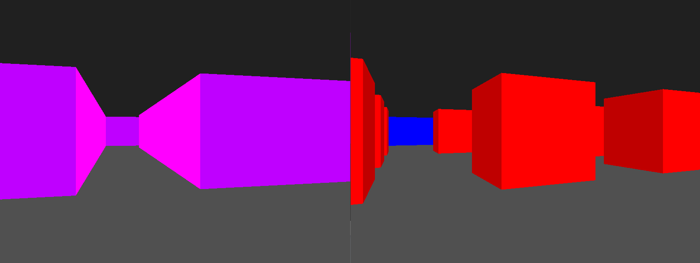

# ray_casting

  Implementation of Wolfenstein/DOOM style software rendering.
  
  I've been wondering, **"How the hell did they manage to make Wolfenstein work even if it doesn't have a GPU to render the graphics????"**.
   <br>
  I decided that to find out, I had to do something similar myself.

  

# Build and run
  First of all, you need to configure `sdl` for rust. You can simply follow the instructions provided here: [rust-sdl2](https://github.com/Rust-SDL2/rust-sdl2)
  ``` bash
  cargo build
  cargo run
  ```

# Resources:
  [Lode Vandevenne - Lode's Computer Graphics Tutorial](https://lodev.org/cgtutor/raycasting.html)
  
